# **Biquadratic Presence Filter**

The Assignment is to implement notch and resonance filters based on a paper's design procedure, validate the implementation by filtering realistic input signals, and explain how the results demonstrate the correct operation of the filters.

In the [main file](/main.ipynb) you can also hear the filtered signals.

$$ H(z)=K \frac{1-2 r_z \cos \omega_c z^{-1}+r_z^2 z^{-2}}{1-2 r_p \cos \omega_c z^{-1}+r_p^2 z^{-2}} $$


```python
# Definition of the designBiquadFilter function

# w_c: center frequency in radians
# G_0: gain at DC
# G_c: gain at resonance
# B: bandwidth in radians
```

## **Testing with the Paper's Design Examples**


```python
# Resonance coefficients
w_c = 2  # rad (0.64pi rad)
G_0 = 1  # 0 db
G_c = 4  # 12 db
```
```python
# Resonance filter with varying bandwidth
designBiquadFilter(w_c, G_0, G_c, 0.01)
designBiquadFilter(w_c, G_0, G_c, 0.1)
designBiquadFilter(w_c, G_0, G_c, 0.2)
```
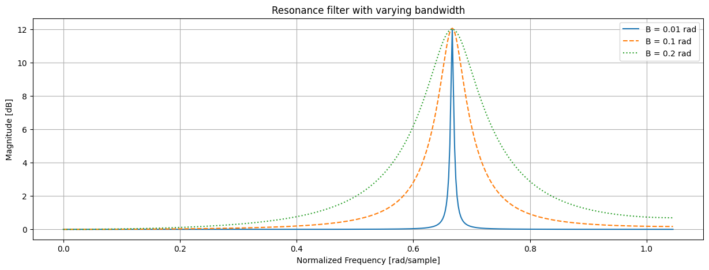

```python
# Resonance filter with varying boost
B = 0.1 # rad (0.032 pi rad)
designBiquadFilter(w_c, G_0, 2, B)
designBiquadFilter(w_c, G_0, 3, B)
designBiquadFilter(w_c, G_0, 4, B)
```
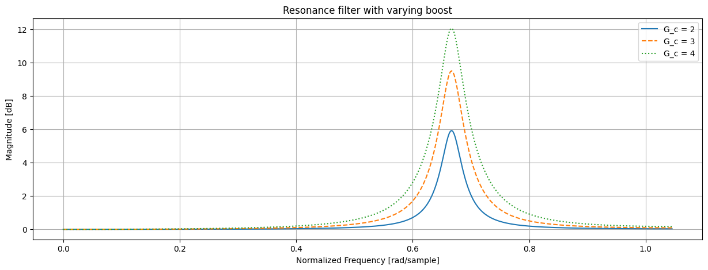
```python
# Resonance
designBiquadFilter(1, 1, 0.7, 0.05)
designBiquadFilter(2, 1, 4, 0.1)
```
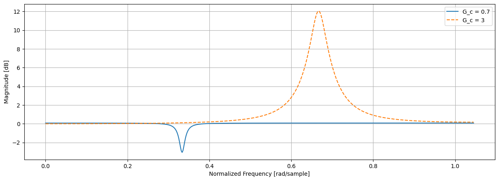
    

## **Application in a Real Life Signal** 

### **1. Notch Filter**
The signal used is an audio signal made of three components/instruments. Each of those components lies on a different part of the frequency spectrum. \
\
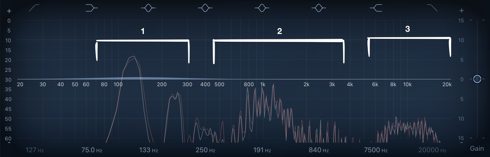 

The goal of this application is to filter out one of the components without affecting the other two.

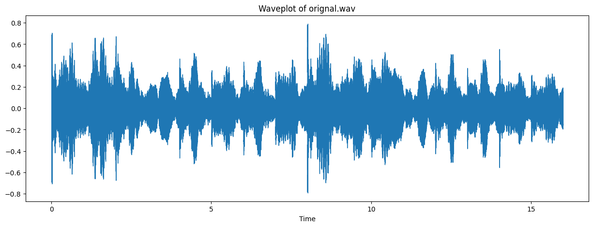    

    

From the above spectogram we can see three distinct instruments playing at the C3, C4 and C6 octaves, around 128, 256, 1024 Hz.

```python
designBiquadFilter( 0.3, 1, 0.10, 0.04)
```
    
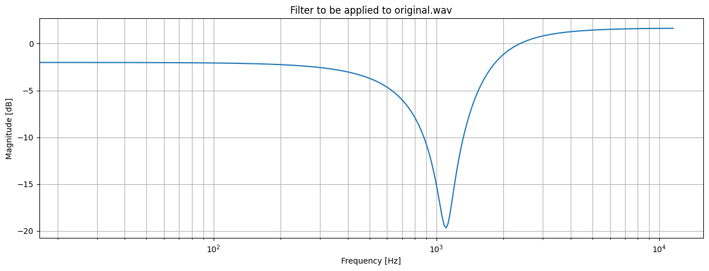
    
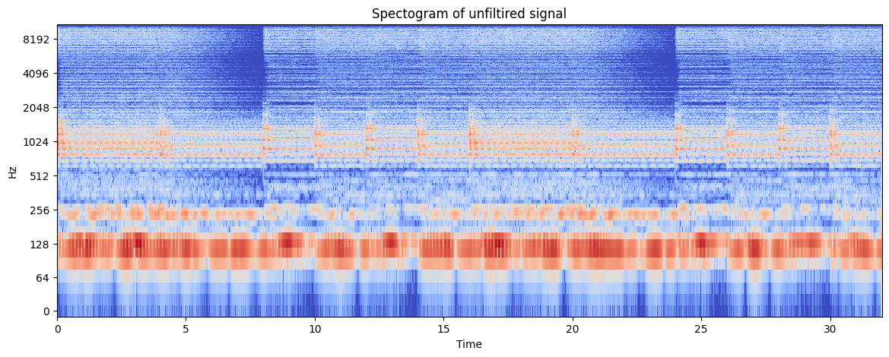
        
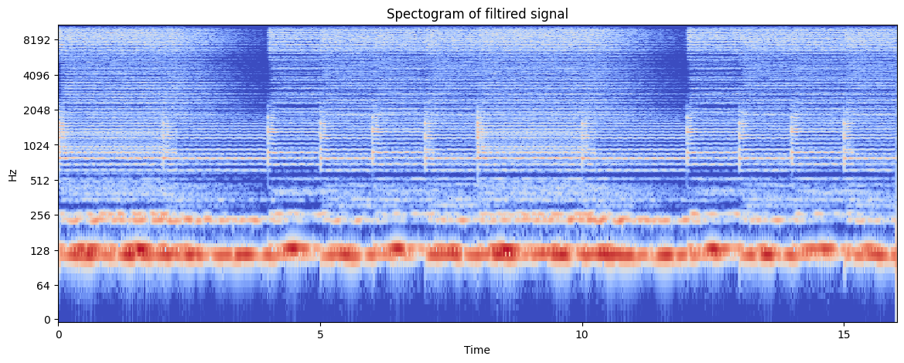
    

We have effectivly attenuated the signal at C6 / 1024 Hz, without majorly affecting the other two signals. 


### **2. Resonance Filter + Negative DC Gain**
The following signal is composed of drums, piano and a high pitch wind instrument *(I think)*.
    
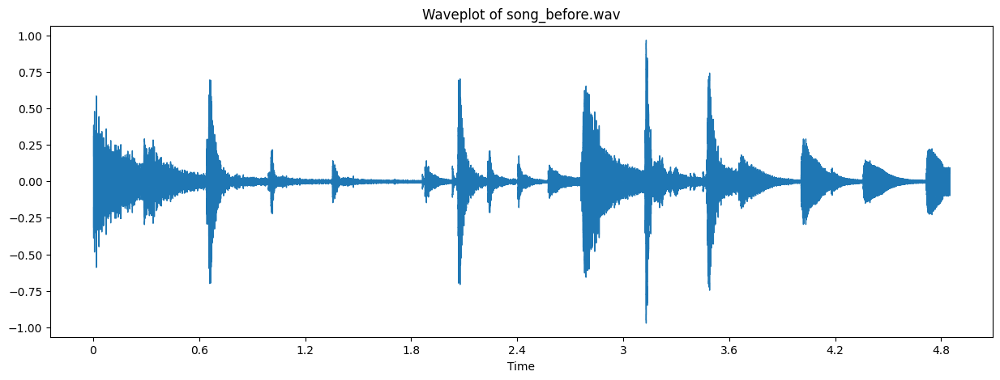
    

    

From the above spectogram we can see that the sound is spread out more than the previous signal. 

We are now going to filter the signal to retain only the high-pitch wind instrument.


```python
designBiquadFilter( 2.7, 0.01, 100, 0.02)
```
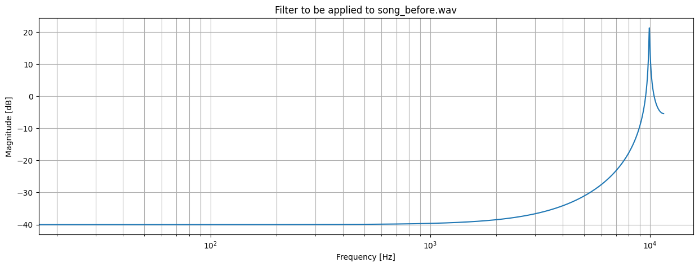
  
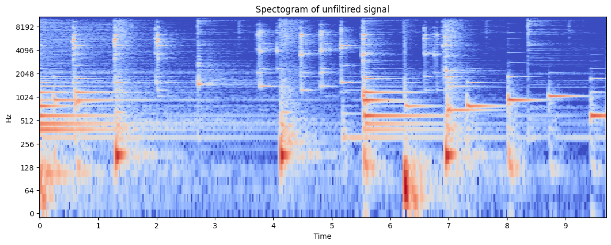
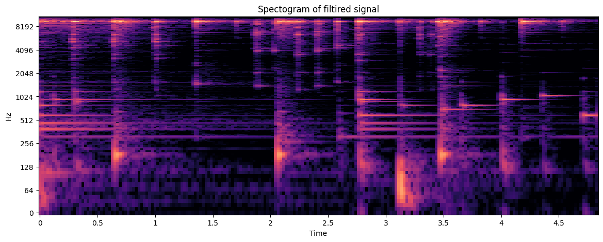
    

